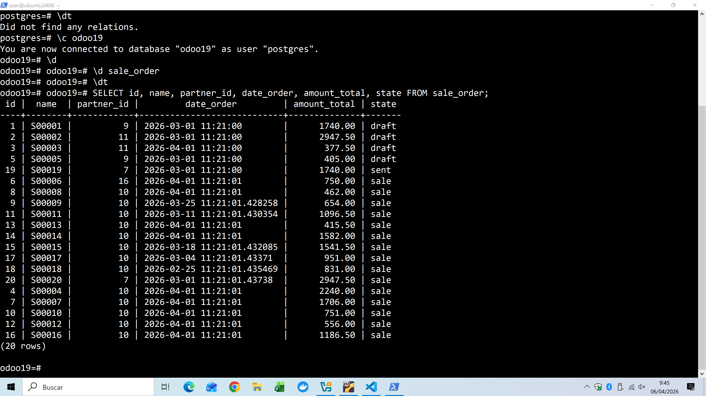
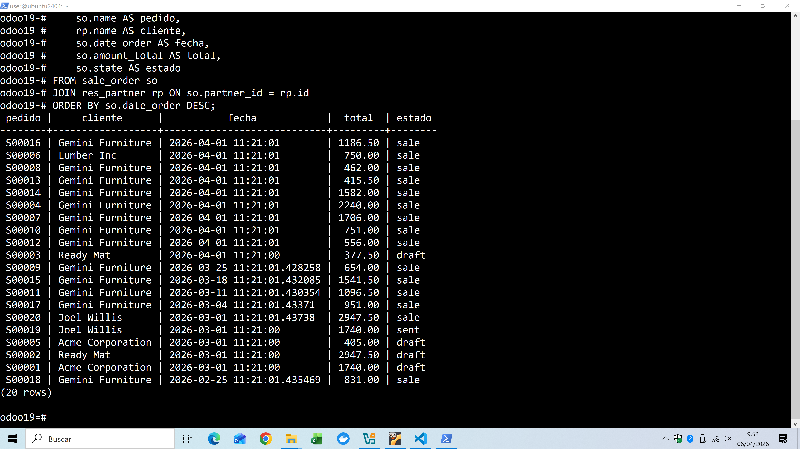
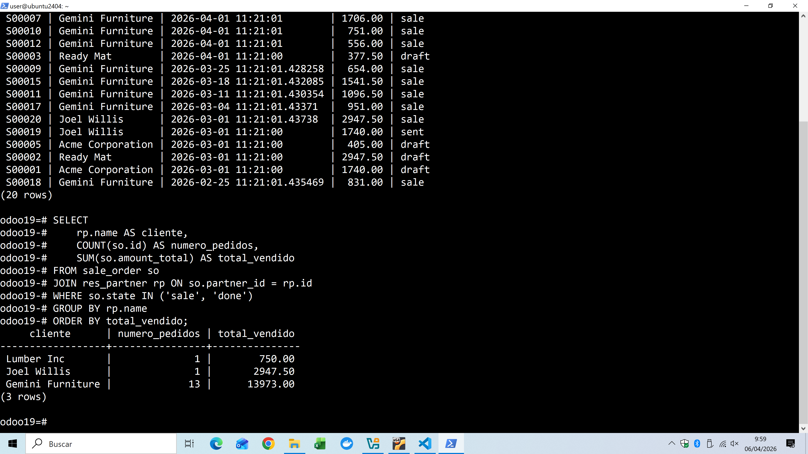

# La información está repartida en varias tablas
- clientes: res_partner
- pedidos de ventas: sale_order
- lineas de pedidos: sale_order_line
- productos: product_product y product_template

## Una venta completa no suele estar en una sola tabla
- sale_order -> guarda la cabecera del pedido: cliente, fecha, estado, total...
- sale_order_line -> guarda el detalle: qué producto, cantidad, precio...
- res_partner -> guarda el cliente
- product_product / product_template guardan el producto

**para sacar un informe útil hay que realacionar tablas.**

### Tablas principales
- res_partner
    - campos:
        - id -> identificador cliente
        - name -> nombre
        - email -> correo
        - phone -> teléfono
        - customer_rank -> indicador uso como cliente
- sale_order
    - campos:
        - id -> identificador pedido
        - name -> referencia del pedido
        - partner_id -> cliente
        - date_order -> fecha del pedido
        - amount_total -> importe pedido
        - state -> estado del pedido
- sale_order_line
    - campos:
        - id 
        - order_id -> a qué pedido pertenece
        - product_id -> producto vendido
        - product_uom_qty -> cantidad
        - price_unit -> precio unitario
        - price_subtotal -> subtotal línea
- product_product
    - variante concreat del producto
- product_template
    - información general del producto

## Realizar consultas con SQL
#### Consulta básica ventas
```sql
SELECT id, name, partner_id, date_order, amount_total, state FROM sale_order;
```

#### Consulta ventas con nombre de cliente
```sql
SELECT  
    so.name AS pedido,
    rp.name AS cliente,
    so.date_order AS fecha,
    so.amount_total AS total,
    so.state AS estado
FROM sale_order so
JOIN res_partner rp ON so.partner_id = rp.id
ORDER BY so.date_order DESC;
```


#### Consulta ventas por cliente
```sql
SELECT
    rp.name AS cliente,
    COUNT(so.id) AS numero_pedidos,
    SUM(so.amount_total) AS total_vendido
FROM sale_order so
JOIN res_partner rp ON so.partner_id = rp.id
WHERE so.state IN ('sale', 'done')
GROUP BY rp.name
ORDER BY total_vendido;
```

